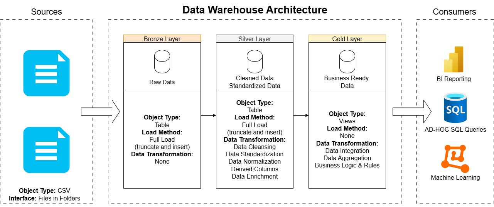
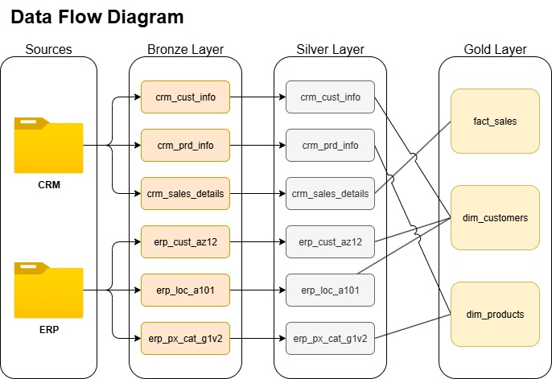
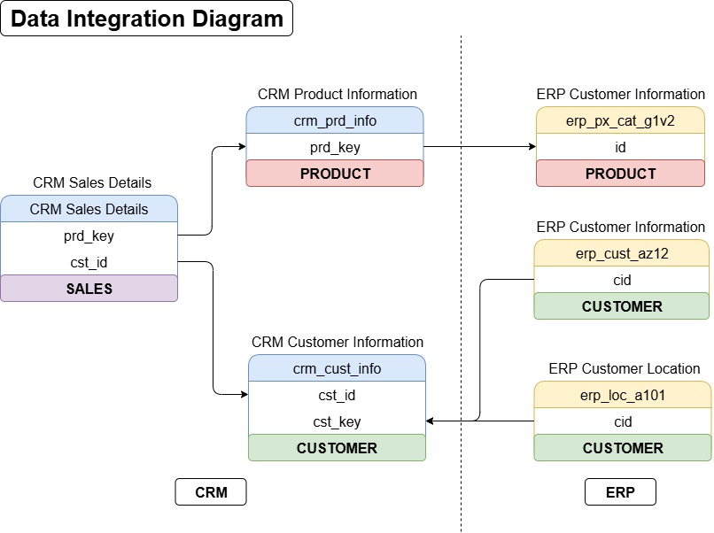
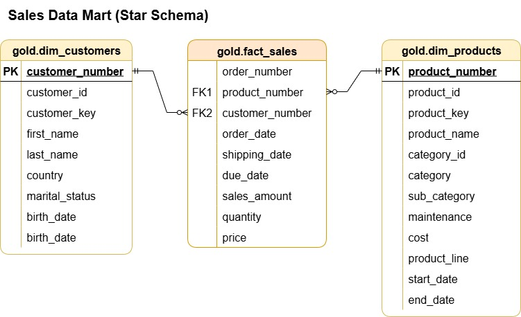

# SQL-Data-Warehouse

Modern data warehouse implementation using PostgreSQL, with well-structured ETL
pipelines, clear data models, and integrated analytics for end-to-end data
management.

## Description

This project implements a modern data warehouse using PostgreSQL, following a
layered architecture (Bronze, Silver, Gold) to manage data from CRM and ERP
sources. The warehouse handles customer, product, and sales data, performing
ETL operations to clean, transform, and aggregate information for business
analytics.

The Bronze layer stores raw data loaded from CSV files. The Silver layer cleans
and standardizes this data using PL/pgSQL procedures, handling tasks like
deduplication, trimming, and value standardization. The Gold layer provides
curated views using dimensional modeling (star schema), reconciling data from
multiple sources to create unified customer and product profiles along with
sales facts. This setup supports reporting, dashboards, and analytical queries,
ensuring data consistency through business rules.

Key problems solved:

- Integrating disparate data from CRM and ERP systems.
- Ensuring data quality through cleaning and reconciliation.
- Providing optimized structures for business intelligence tools like BI
  reporting, SQL queries, ad-hoc analysis, and machine learning.

## Features

- **Layered Architecture**: Bronze (raw), Silver (cleaned), Gold (curated)
  layers for progressive data refinement.
- **ETL Pipelines**: PL/pgSQL procedures for loading, cleaning, and
  transforming data, with timing logs for performance monitoring.
- **Data Reconciliation**: Merges CRM and ERP data, preferring sources based on
  rules (e.g., CRM for gender unless unknown, then ERP).
- **Dimensional Modeling**: Star schema in the Gold layer with dimension
  tables (customers, products) and fact table (sales).
- **Master Scripts**: `init_datawarehouse.sql` for full initialization and
  `data_refresh.sql` for refreshing data without recreating the database.
- **Security**: Restricts public access to the database schema.
- **Documentation**: Includes data flow diagrams, architecture overview, data
  models, and a data catalog for the Gold layer.

## Architecture

The data warehouse follows a medallion architecture:

- **Bronze Layer**: Raw data ingestion from sources. Tables mirror source
  structures with minimal transformation (full load/truncate-insert from CSVs).
- **Silver Layer**: Data cleaning and standardization. Uses temporary tables
  for processing, removes nulls/duplicates, trims strings, standardizes
  values (e.g., 'M' to 'Married'), and adds timestamps.
- **Gold Layer**: Business-ready data. Views aggregate and join Silver data,
  applying business logic for reconciliation and using surrogate keys for
  dimensions.

Consumers can access the Gold layer via BI tools, SQL queries, ad-hoc analysis,
or machine learning interfaces.



## Data Flow

Data flows from sources (CRM and ERP CSVs) into Bronze tables, then transformed
into Silver, and finally aggregated into Gold views.

- **Sources**: CRM (customer info, product info, sales details) and ERP (
  customer demographics, locations, product categories).
- **Bronze**: Direct copies like `bronze.crm_cust_info`,
  `bronze.erp_cust_az12`.
- **Silver**: Cleaned versions like `silver.crm_cust_info`, with procedures for
  each table.
- **Gold**: Views like `gold.dim_customers`, `gold.dim_products`,
  `gold.fact_sales`.




## Data Model

The Gold layer uses a star schema for efficient querying:

- **Fact Table**: `gold.fact_sales` – Contains measures like sales_amount,
  quantity, price, with foreign keys to dimensions.
- **Dimension Tables**:
    - `gold.dim_customers` – Customer details with surrogate key.
    - `gold.dim_products` – Product details with surrogate key.



## Data Catalog

The Gold layer contains business-level representations of data, designed to
support business-level analytics. It aggregates and reconciles data from the
Silver layer, providing unified customer and product profiles along with sales
fact data. These views are optimized for reporting, dashboards, and analytical
queries, leveraging surrogate keys for dimensional modeling and ensuring data
consistency through predefined business rules.

### 1. gold.dim_customers

| Column Name     | Data Type | Description                                                                                                   | Example Value    |
|-----------------|-----------|---------------------------------------------------------------------------------------------------------------|------------------|
| customer_number | INTEGER   | A unique surrogate key assigned sequentially based on cst_id, may shift on data changes.                      | 1                |
| customer_id     | VARCHAR   | Unique identifier for the customer from CRM data.                                                             | 11000            |
| customer_key    | VARCHAR   | Alternate key for the customer, used for cross-system matching.                                               | AW00011000       |
| first_name      | VARCHAR   | Customer's first name from CRM.                                                                               | John             |
| last_name       | VARCHAR   | Customer's last name from CRM.                                                                                | Doe              |
| country         | VARCHAR   | Customer's country from ERP location data, defaults to 'Unknown' if missing.                                  | Australia        |
| gender          | VARCHAR   | Customer's gender, prefers CRM value unless 'Unknown', then uses ERP gen if available, defaults to 'Unknown'. | Male             |
| marital_status  | VARCHAR   | Customer's marital status from CRM.                                                                           | Married / Single |
| birth_date      | DATE      | Customer's birth date from ERP, falls back to create_date if missing.                                         | 05-15-1990       |
| create_date     | DATE      | Date when the customer record was created in CRM.                                                             | 01-10-2023       |

### 2. gold.dim_products

(Based on the provided gold_ddl.sql script; add actual examples if available)

| Column Name    | Data Type | Description                                                                    | Example Value  |
|----------------|-----------|--------------------------------------------------------------------------------|----------------|
| product_number | INTEGER   | A unique surrogate key assigned sequentially based on prd_start_dt and prd_id. | 1              |
| product_id     | INTEGER   | Unique identifier for the product from CRM data.                               | 123            |
| product_key    | VARCHAR   | Alternate key for the product.                                                 | BK-M68B-42     |
| product_name   | VARCHAR   | Product name from CRM.                                                         | Mountain-200   |
| category_id    | VARCHAR   | Category ID from CRM.                                                          | 1              |
| category       | VARCHAR   | Product category from ERP.                                                     | Bikes          |
| sub_category   | VARCHAR   | Product sub-category from ERP.                                                 | Mountain Bikes |
| maintenance    | VARCHAR   | Maintenance flag from ERP (Yes/No/Unknown).                                    | Yes            |
| cost           | NUMERIC   | Product cost from CRM.                                                         | 1250.00        |
| product_line   | VARCHAR   | Product line from CRM.                                                         | M              |
| start_date     | DATE      | Product start date from CRM.                                                   | 2011-07-01     |
| end_date       | DATE      | Product end date from CRM.                                                     | NULL           |

### 3. gold.fact_sales

| Column Name     | Data Type | Description                                   | Example Value |
|-----------------|-----------|-----------------------------------------------|---------------|
| order_number    | VARCHAR   | Sales order number from CRM.                  | SO43659       |
| product_number  | INTEGER   | Surrogate key referencing gold.dim_products.  | 1             |
| customer_number | INTEGER   | Surrogate key referencing gold.dim_customers. | 1             |
| order_date      | DATE      | Order date from CRM.                          | 2011-05-31    |
| shipping_date   | DATE      | Shipping date from CRM.                       | 2011-06-07    |
| due_date        | DATE      | Due date from CRM.                            | 2011-06-12    |
| sales_amount    | NUMERIC   | Total sales amount.                           | 2319.99       |
| quantity        | INTEGER   | Quantity sold.                                | 1             |
| price           | NUMERIC   | Unit price.                                   | 2319.99       |

## Project Structure

- `/scripts/`: Contains all SQL scripts.
    - `init_datawarehouse.sql`: Master script for initializing the entire
      warehouse.
    - `data_refresh.sql`: Script for refreshing data.
    - `/bronze/`: Bronze DDL and load scripts.
    - `/silver/`: Silver DDL and load procedures.
    - `/gold/`: Gold view creation script.
- `/docs/`: Diagrams and data catalog (PDFs like DataFlowDiagram.pdf,
  DataCatalog.pdf).
- Source data CSVs are referenced in load scripts (e.g., under
  `project_files/data_warehouse_project/source_crm/`).

## Prerequisites

To set up and run this data warehouse project, you'll need the following software:

- **PostgreSQL**: The database server (version 17 or compatible). Download and install from the official PostgreSQL website: [https://www.postgresql.org/download/](https://www.postgresql.org/download/).
- **psql Client**: The command-line tool for interacting with PostgreSQL (included with PostgreSQL installation).
- **Database Client**: A GUI tool for querying and managing the database, such as pgAdmin (included with PostgreSQL), DataGrip, or VS Code with the PostgreSQL extension.

Ensure PostgreSQL is running on your system, and you have administrative access to create databases and schemas.

You'll also need the source CSV datasets (e.g., `cust_info.csv`, `prd_info.csv`, etc., from CRM and ERP sources). These are referenced in the load scripts and must be placed in a specific directory accessible by PostgreSQL.

## Installation and Setup

Follow these steps to install and configure the data warehouse. The process involves placing CSV files, updating file paths in scripts, and executing master scripts via psql.

### Step 1: Place the Dataset CSV Files
Copy your source CSV files into a directory within PostgreSQL's data path for secure access. The recommended path is similar to `C:\Program Files\PostgreSQL\17\data\<your_folder_name>`, where `<your_folder_name>` can be any name (e.g., `project_files`). This ensures the PostgreSQL server can read the files without permission issues.

Create the directory if it doesn't exist, and organize the CSVs under subfolders like `data_warehouse_project/source_crm/` and `data_warehouse_project/source_erp/`.

Example directory structure (replace `<your_folder_name>` with your chosen name, e.g., `my_data_files`):

```
C:\Program Files\PostgreSQL\17\data\<your_folder_name>\data_warehouse_project\source_crm\cust_info.csv
C:\Program Files\PostgreSQL\17\data\<your_folder_name>\data_warehouse_project\source_crm\prd_info.csv
C:\Program Files\PostgreSQL\17\data\<your_folder_name>\data_warehouse_project\source_crm\sales_details.csv
C:\Program Files\PostgreSQL\17\data\<your_folder_name>\data_warehouse_project\source_erp\CUST_AZ12.csv
C:\Program Files\PostgreSQL\17\data\<your_folder_name>\data_warehouse_project\source_erp\LOC_A101.csv
C:\Program Files\PostgreSQL\17\data\<your_folder_name>\data_warehouse_project\source_erp\PX_CAT_G1V2.csv
```

### Step 2: Update File Paths in bronze_load.sql
Open the `bronze_load.sql` script in a text editor. Do not modify any other parts of the script—only update the file paths in the `COPY` statements to match where you placed your CSVs.

For example, update this line for the product categories table (and similarly for all other `COPY` statements):

```sql
-- Original (example)
copy bronze.erp_px_cat_g1v2 (id, cat, subcat, maintenance)
    from 'C:\\Program Files\\PostgreSQL\\17\\data\\project_files\\data_warehouse_project\\source_erp\\PX_CAT_G1V2.csv'
    delimiter ',' csv header;

-- Updated (replace with your actual path, e.g., if your folder is 'my_data_files')
copy bronze.erp_px_cat_g1v2 (id, cat, subcat, maintenance)
    from 'C:\\Program Files\\PostgreSQL\\17\\data\\my_data_files\\data_warehouse_project\\source_erp\\PX_CAT_G1V2.csv'
    delimiter ',' csv header;
```

Repeat for all `COPY` commands in the script (there are 6 total, one for each Bronze table).

### Step 3: Update Script Paths in init_datawarehouse.sql
Open `init_datawarehouse.sql` in a text editor. Update the paths in the `\i` commands to point to the actual location of your script files on your system.

For example:

```sql
-- Original (example)
\i 'C:\\Users\\Administrator\\Desktop\\Projects\\SQLDataWarehouseProject\\sql-data-warehouse\\scripts\\init_database.sql'

-- Updated (replace with your actual project directory, e.g., if scripts are in 'D:\MyProjects\sql-warehouse\scripts')
\i 'D:\\MyProjects\\sql-warehouse\\scripts\\init_database.sql'
```

Do this for all `\i` statements in the script (e.g., for bronze_ddl.sql, bronze_load.sql, silver_ddl.sql, etc.).

### Step 4: Update Script Paths in data_refresh.sql
Similarly, open `data_refresh.sql` and update the path in the `\i` command for the Gold layer script.

For example:

```sql
-- Original (example)
\i 'C:\\Users\\Administrator\\Desktop\\Projects\\SQLDataWarehouseProject\\sql-data-warehouse\\scripts\\gold\\gold_ddl.sql'

-- Updated (replace with your actual path)
\i 'D:\\MyProjects\\sql-warehouse\\scripts\\gold\\gold_ddl.sql'
```

### Step 5: Run the Initialization Script
Once paths are updated, execute `init_datawarehouse.sql` to set up the database. This script drops and recreates the `sql_data_warehouse` database, sets up schemas, loads data, and builds layers.

Use one of these methods:

- **Option 1: From Terminal/Command Prompt**  
  Navigate to the directory containing `init_datawarehouse.sql` and run:  
  ```bash
  psql -h localhost -U your_username -d postgres -f init_datawarehouse.sql
  ```  
  Replace `localhost` with your host (if not local), `your_username` with your PostgreSQL username, and the path if needed. You'll be prompted for your password.

- **Option 2: Inside psql**  
  Open psql (e.g., `psql -U your_username -d postgres`), then run:  
  ```sql
  \i 'D:\\MyProjects\\sql-warehouse\\scripts\\init_datawarehouse.sql'
  ```  
  Replace with the full path to your `init_datawarehouse.sql` file.

If everything is configured correctly (paths, permissions, and CSVs in place), the warehouse will set up in seconds, and you'll see a success message: "Data Warehouse created and initialized successfully!"

### Step 6: Refresh Data (Optional)
If you update the source CSVs later, run `data_refresh.sql` to reload Bronze/Silver and rebuild Gold without recreating the database.

Use similar methods as Step 5, but connect to `sql_data_warehouse` instead of `postgres` for the terminal option:  
```bash
psql -h localhost -U your_username -d sql_data_warehouse -f data_refresh.sql
```

Or inside psql (after `\c sql_data_warehouse`):  
```sql
\i 'D:\\MyProjects\\sql-warehouse\\scripts\\data_refresh.sql'
```

You'll see: "Data Refreshed Successfully!"

### Troubleshooting
- **Permission Issues**: Ensure the PostgreSQL service account has read access to your CSV directory. On Windows, this is usually the `postgres` user.
- **Path Errors**: Double-check double backslashes (`\\`) in Windows paths within SQL scripts.
- **Connection Errors**: Verify PostgreSQL is running and your username/password are correct.
- After setup, connect via your database client (e.g., pgAdmin) to `sql_data_warehouse` and query the Gold layer views (e.g., `SELECT * FROM gold.dim_customers LIMIT 10;`) to verify.

### Future Improvements
If time permits (due to college), I will also work on a metadata and audit 
schema to file data quality issues in the source and tabulate logs of data flow in the data warehouse.